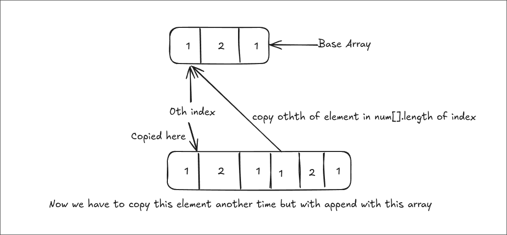

# https://leetcode.com/problems/concatenation-of-array/

# How I Solve

So basically we have to append element of array with itself

like
[1,2,1]<-base array
[1,2,1,1,2,1] <- Output array

i solve this problem using arraycopy() that copy base array element from 0th index till arr.length
to newarr also starting 0th index

```java
System.arraycopy(nums,0,newarr,0,nums.length);
```

in this line we copied nums elements from 0th index To newarr and coping start from 0th index till nums.length
Output [1,2,1] <- we get first half

Now For second half

```java
System.arraycopy(nums, 0, newarr, nums.length, nums.length);
```

Here we are copy nums[] element start from 0th index To newarr[] but here we put copied element to the nums.length th element


look in this picture we copy 0th index element to last index of newarr[]<- num.length
And we copy till num.length

## Full Code

```java
class Solution {
    public int[] getConcatenation(int[] nums) {
        int[] newarr = new int[nums.length * 2];

        System.arraycopy(nums,0,newarr,0,nums.length);
        System.arraycopy(nums, 0, newarr, nums.length, nums.length);
        return newarr;
    }
}
```
