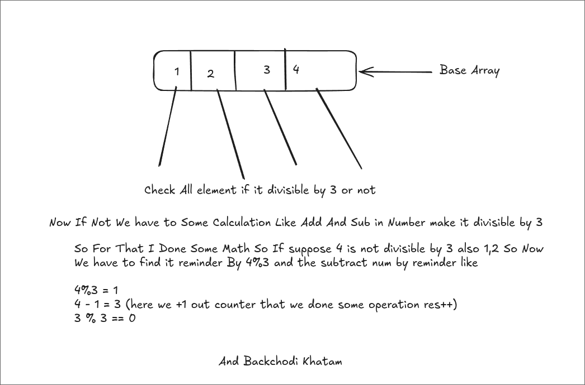

# https://leetcode.com/problems/find-minimum-operations-to-make-all-elements-divisible-by-three/

# How I Solve 
So In This Problem we have to check that given elements of array is divisible by 3 or not 
if not we have to do some operation for make it divisible So Let;s see the solution 



```java
class Solution {
    public int minimumOperations(int[] nums) {
        int res = 0;
        for(int  i = 0; i < nums.length; i++){
            if(nums[i]%3 != 0){
                int opr = nums[i]%3;
                int end = nums[i] - opr;
                if(end%3 == 0) {
                    res++;
                }
            }
        }
        return res;
    }
}
```

We Take One Counter (res) for track operation 
that iterate over array element Using For loop 
Check Reminder of array element if not 0 
we have magic method to make any number divisible by 3 
for that we first take reminder of elment that have satisfiy if condition 
and subtract that elemnet value by reminder 
Like 4 % 3 = 1 -> 4 - 1 = 3 -> 3 % 3 = 0 
and we +1 counter where we subtract reminder 
