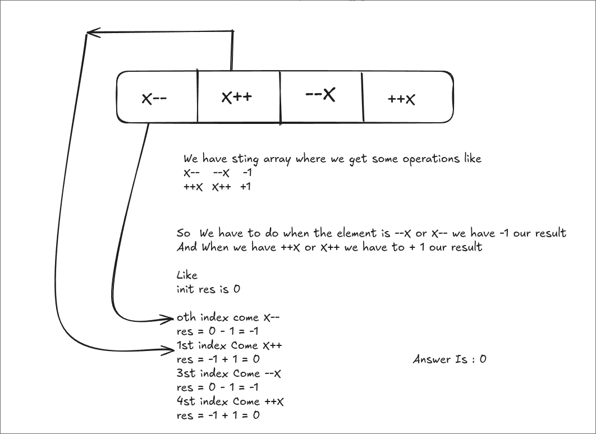

# https://leetcode.com/problems/final-value-of-variable-after-performing-operations

# How I solve



So We have to do when the element is --X or X-- we have -1 our result
And When we have ++X or X++ we have to + 1 our result

Like
init res is 0

oth index come X--
res = 0 - 1 = -1
1st index Come X++
res = -1 + 1 = 0  
3st index Come --X
res = 0 - 1 = -1
4st index Come ++X
res = -1 + 1 = 0
Answer Is : 0

```java
class Solution {
    public int finalValueAfterOperations(String[] operations) {

        int res = 0;
        int length = operations.length;

        for (String opr : operations){
            if (opr.equals("--X") || opr.equals("X--")){
                res = res - 1;
            }
            else if (opr.equals("++X") || opr.equals("X++")){
                res = res + 1;
            }
        }
        return res;
    }
}
```

For That I use String[] opration for comparing elemnts with above operations like "--x / ++x..."
So The Function equals() will compare elemnts with condition
I try == this oprator but not work cause it string[]
